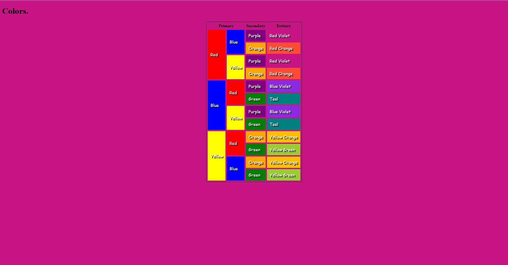

# 🎨 Colors

Una pequeña aplicación web enfocada en colores, creada con tecnologías web básicas.

## 🚀 Preview

<p align="center">
  
</p>

## 🛠️ Stack


## 📂 Estructura del proyecto

```text
colors/
├── css/
├── img/
│   └── preview-red-violet-color.jpg
├── index.html
└── README.md
```

## ✨ Características

- 🎨 Interfaz simple y limpia.
- 📱 Diseño adaptable.
- ⚡ Sin dependencias externas.
- 🌐 Hecho únicamente con HTML y CSS.

## 🚀 Preview (Al seleccionar un COLOR, el fondo cambia de COLOR!!!)

<p align="center">
  
</p>

---

Hecho con ❤️ por **Kinmar**.# 🎨 Colors

Una pequeña aplicación web enfocada en colores, creada con tecnologías web básicas.
